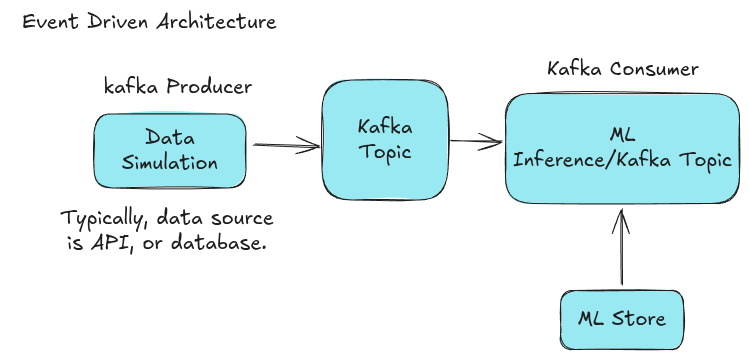
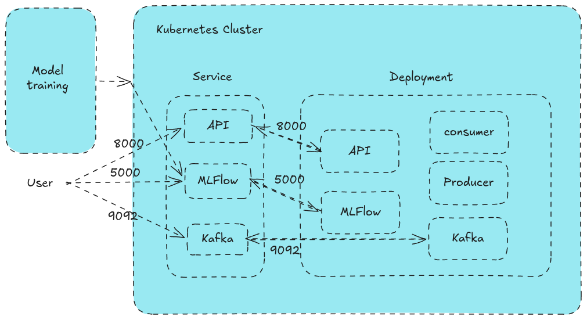
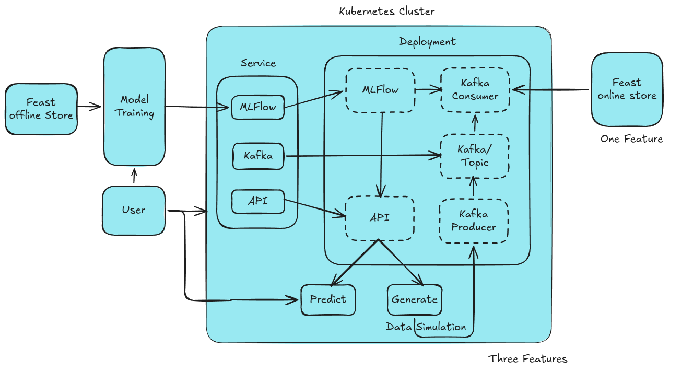
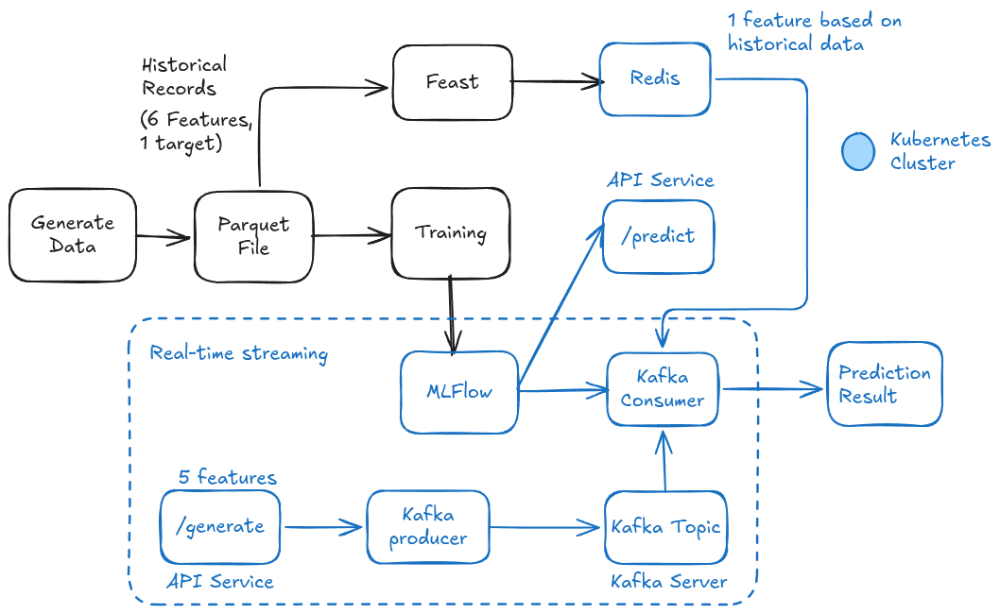

## Building a Real-Time Fraud Detection System

Building a real-time financial fraud detection system using MLOps tools: Kafka, Docker, Scikit-learn, FastAPI, and Feast.

### Kafka
It is a distributed streaming platform, known for its fault tolerance and scalability.

### Docker
It is a containerization platform, used to package applications and their dependencies into containers.

### Feast (Feature Store)
A tool to manage and serve machine learning features in real-time with low latency.

### MLflow
Used for tracking experiments and managing the model registry.

### Kubernetes
Used for container orchestration.

### Part 1: Kafka + FastAPI

**First step: Training**


**Second Step: Simple API Setup**


**Third Step: Kafka Streaming**



---
### Part 2: MLFlow & Kubernetes



---

# Part 3: Feature Store & Data Simulator

**Part 1: Kafka + Docker + FastAPI + Scikit-learn + Docker Compose**

**Part 2: Kafka + Docker + FastAPI + Scikit-learn + Kubernetes + MLFlow**

**Part 3: Kafka + Docker + FastAPI + Scikit-learn + Kubernetes + MLFlow + Feast + Data Simulator**

<!--
## High-Level System Architecture

### 🗺️ The "Financial Airport" Analogy (Updated)

Think of your system like a busy airport security checkpoint:

1.  **The Information Desk (Combined API & Simulator)**: 
    -   **News Feed**: It generates a constant stream of transaction events.
    -   **Public Hotline**: It answers specific fraud check requests from the outside world.
2.  **The Traveler (Producer)**: Grabs information from the API news feed and announces it to the airport.
3.  **The Information Hub (Kafka)**: A central messenger where all transaction logs are kept in a line so nobody gets lost.
4.  **The Customs Database (Feast/Redis)**: A lightning-fast digital file that stores pre-calculated info on travelers (features) so the detective doesn't have to recalculate things manually.
5.  **The Security Manual (MLflow)**: A central database that stores the latest trained "rules" (models).
6.  **The Detective (Consumer)**: Watches the Kafka logs, grabs extra info from the **Customs Database**, checks the **Security Manual**, and flags "Fraud" or "Legit."
*/
!-->

---
### Part 3: Architecture



---

## 📦 Component Roles

### 1. Combined API & Simulator
A single FastAPI service that serves two purposes:
-   `POST /predict`: Real-time fraud prediction for external requests.
-   `GET /generate`: Data simulation for the real-time pipeline.

### 2. Feast Feature Store
Feast manages our features (like transaction amount, user age, etc.). 
- **Registry**: Tracks what features exist.
- **Online Store (Redis)**: Provides ultra-low latency feature retrieval for the Consumer.

#### 🧠 Understanding the "Dual Nature" of Feast
Feast solves the "data consistency" problem by using two types of storage:

1.  **Offline Store (Parquet Files)**: Useful for **Model Training**. It stores the full historical record of millions of transactions. It is optimized for large batch reads over long time periods.
2.  **Online Store (Redis)**: Useful for **Real-Time Prediction**. It stores only the *latest* feature value for each user/entity. It is optimized for sub-millisecond lookups when a Kafka message needs to be enriched instantly.

**Syncing the two**: We use a process called **Materialization** to move the latest data from the historical Parquet files into the fast Redis store.

---

## 🛠️ Tools We Use
- **Minikube / Kubernetes**: The orchestrator.
- **Kafka**: The message broker.
- **MLflow**: Model management and registry.
- **Feast**: Feature Store.
- **Redis**: Low-latency feature storage.
- **FastAPI**: For the unified API and Simulator.
- **Scikit-learn**: Machine learning logic.

---

## 🛠️ Commands

### 1. Building Docker Images

```bash
docker build -t real-time-fraud-detection-api:latest -f dockerfiles/Dockerfile.api .
docker build -t real-time-fraud-detection-producer:latest -f dockerfiles/Dockerfile.producer .
docker build -t real-time-fraud-detection-consumer:latest -f dockerfiles/Dockerfile.consumer .
```

### 2. Loading Docker Images into Minikube

```bash
minikube image load real-time-fraud-detection-api:latest
minikube image load real-time-fraud-detection-producer:latest
minikube image load real-time-fraud-detection-consumer:latest
```

### 3. Deploying on Kubernetes

```bash
kubectl apply -f k8s-deployment.yaml
```

## Part 4: Feast In Real-time Fraud Detection




### Initializing & Materializing Feast
Once the pods are running, apply and sync the features:
```bash
# 1. Generate dummy data with aggregates
python generate_data.py

# 2. Register features (from within feature_repo/)
feast apply

# 3. Materialize to Kubernetes Redis (via port-forwarding for local sync)
kubectl port-forward svc/redis 6379:6379 &
REDIS_HOST=localhost feast materialize 2026-03-10T00:00:00 2026-03-13T00:00:00

# 🧪 Model Training & Inference

### 1. Training from Offline Store
The model now trains directly on the historical Parquet data managed by Feast. 
```bash
# Ensure MLflow is reachable (port-forward if local)
kubectl port-forward svc/mlflow 5000:5000 &

# Run training script
python app/train.py
```
This script:
- Loads data from `feature_repo/data/transactions.parquet`.
- Uses engineered features like `avg_30d_spending`.
- Logs metrics and registers the model in MLflow.

### 2. Real-Time Inference (Demo)
Verify that the inference service can pull the exact same features from Redis:
```bash
REDIS_HOST=localhost python fetch_features.py
```

### Next Upgrades:
1. Prometheus + Grafana Monitoring Setup
2. CI/CD Pipeline using GitOps/GitHub Actions
