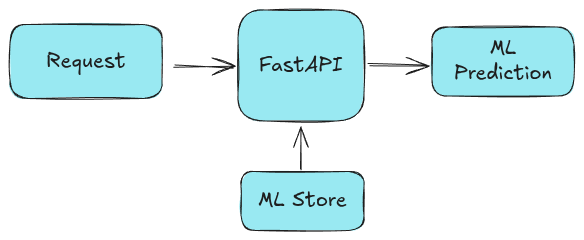

## Building a Real-Time Fraud Detection System

Building a real-time financial fraud detection system using MLOps tools: Kafka, Docker, Scikit-learn, FastAPI.

### Kafka

It is a distributed streaming platform, known for its fault tolerance and scalability.

### Docker

It is a containerization platform, used to package applications and their dependencies into containers.

### Docker Compose

It is a tool for defining and running multi-container Docker applications.

### Scikit-learn

It is a free software machine learning library for the Python programming language.

### FastAPI

It is used for building RESTAPIs.

### Tutorial Breakdown

**First step: Training**

**Second Step: Simple API Setup**

**Third Step: Kafka Streaming**

### Next Upgrades:

1. MLFlow Model Management
2. Feature Store
3. Prometheus + Grafana Monitoring Setup
4. Deploy In Kubernetes Cluster
5. CI/CD Pipeline using Gitops/GithubActions